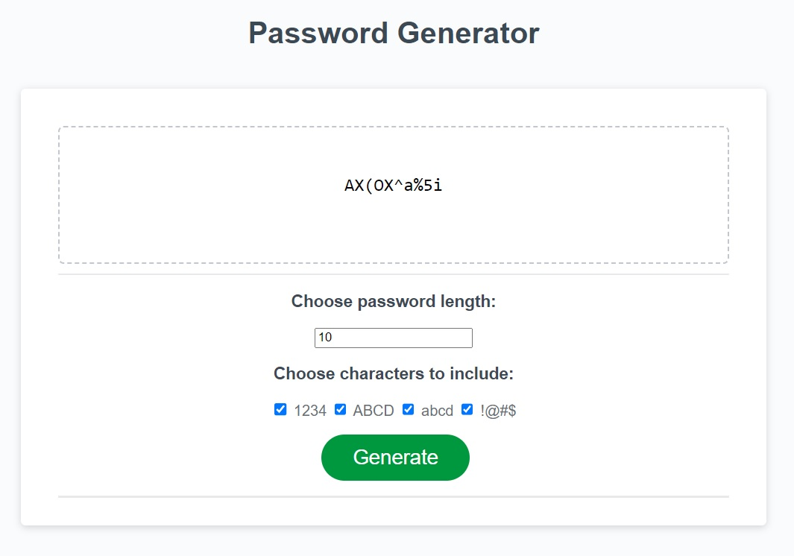

# Random-Password-Generator

## Description

Original files for this project contained a partially completed random password generator application, provided by Denver University's Coding Boot Camp as part of a challenge assignment due 5/22. The assignment required me to make the random password generator operational using JavaScript.

In order to do so, I needed to provide the user with a button that generated a password upon selection. The user required the ability to select or deselect whether uppercase letters, lowercase letters, numbers, and symbols were included in the password. The user could choose the length of the password, but it could not exceed 128 characters or fall below 8.

Additional requirements included the following criteria:

> - Repository includes more than just a unique name
> - Application deployed at live URL.
> - Application loads with no errors.
> - GitHub repository that contains application code.
> - Application user experience is intuitive and easy to navigate.
> - Application user interface style is clean and polished.
> - Application resembles the provided mock-up functionality.

## Installation

N/A

## Usage

To use this random password generator, navigate to https://msjamesm.github.io/Random-Password-Generator in your browser. Begin by entering your desired password length (between 8 and 128 characters) into the outlined input field. If desired, choose which characters to include in your password by deselecting the checkboxes next to the types you wish to exclude. Otherwise, click the green <i>"Generate"</i> button to reveal your new password. Remember, never share your password with others!

## Screenshot

## Credits

Original files for this project were provided by Denver University's Coding Boot Camp (in partnership with edX). I also viewed and referenced materials from the following authors and resources:

https://www.w3schools.com

https://developer.mozilla.org

https://stackoverflow.com

https://www.freecodecamp.org/

https://github.com/Nitij

https://github.com/WebDevSimplified

https://www.youtube.com/@Fireship

## License

N/A
